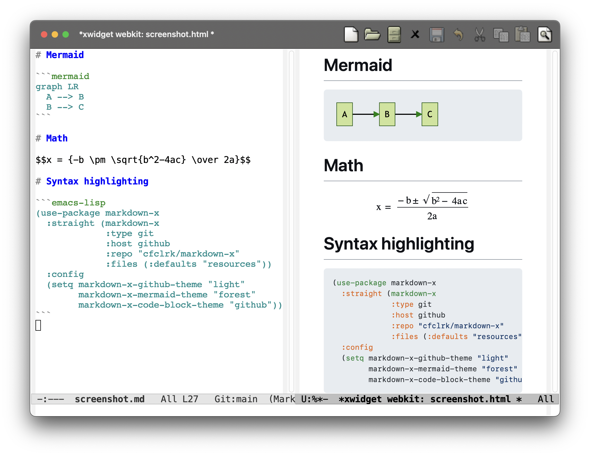
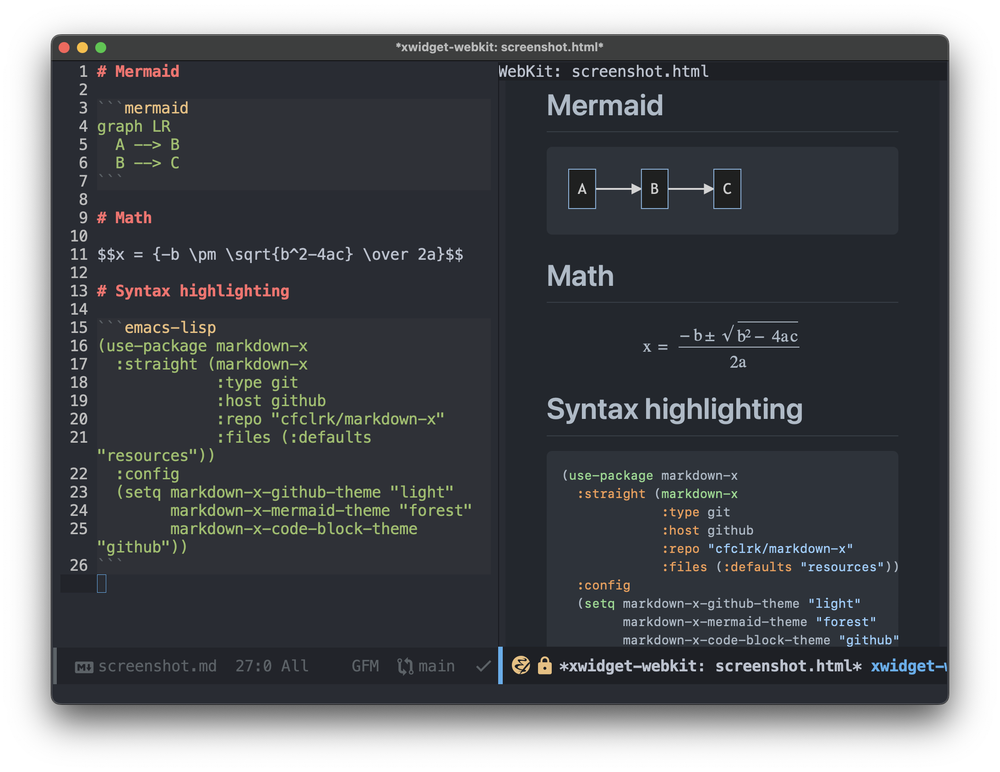

# markdown-xwidget

An Emacs minor mode to preview markdown files using [xwidget-webkit][x].
Features:

- Render markdown using GitHub styles
- Mermaid diagrams
- Syntax highlighting
- Mathjax

| Light                     | Dark                    |
|---------------------------|-------------------------|
|  |  |

These are just two examples. There's a lot of room to customize the theme.

[x]: https://www.gnu.org/software/emacs/manual/html_node/emacs/Embedded-WebKit-Widgets.html

## Prerequisites

This package will not work without the following prerequisites.

1. **Emacs xwidget support**

   This package displays rendered markdown in an xwidget (an embedded browser),
   which only works if your Emacs was compiled `--with-xwidgets`. If you don't
   have xwidget support, you're missing out!

   To check whether your Emacs supports xwidgets, evaluate this in your
   `*scratch*` buffer:

   ```emacs-lisp
   (featurep 'xwidget-internal)
   ;; => t     ; you have xwidgets
   ;; => nil   ; you don't have xwidgets
   ```

   To install Emacs with xwidget support on MacOS, check out
   [homebrew-emacs-plus][emacsplus]:

   ```sh
   brew tap d12frosted/emacs-plus
   brew install emacs-plus --with-xwidgets
   ```

2. **pandoc, multimarkdown, or similar**

   [pandoc][] and [multimarkdown][] are CLI programs that can create HTML from
   markdown. You need a program like this installed. Note: there is currently
   [an issue][gh-7] with pandoc and mermaid.

[emacsplus]: https://github.com/d12frosted/homebrew-emacs-plus
[multimarkdown]: https://fletcher.github.io/MultiMarkdown-6
[pandoc]: https://pandoc.org/
[gh-7]: https://github.com/cfclrk/markdown-xwidget/issues/7

## Installation

Here are some examples of installing and configuring `markdown-xwidget`.

This package is not yet on ELPA/MELPA.

> [!WARNING]
> In all examples below, it's important to specify the `:files` directive!
> Without it, the non-elisp files (CSS and HTML) won't be copied to the right
> place.

### elpaca

```emacs-lisp
(use-package markdown-xwidget
  :after markdown-mode
  :elpaca (markdown-xwidget
           :host github
           :repo "cfclrk/markdown-xwidget"
           :files (:defaults "resources")))
```

### doom

```emacs-lisp
(package! markdown-xwidget
  :recipe (:host github
           :repo "cfclrk/markdown-xwidget"
           :files (:defaults "resources")))
```

### straight

```emacs-lisp
(use-package markdown-xwidget
  :after markdown-mode
  :straight (markdown-xwidget
             :type git
             :host github
             :repo "cfclrk/markdown-xwidget"
             :files (:defaults "resources")))
```

For a fully-working example, see: [straight/init.el][init-straight].

### quelpa

For a fully-working example, see: [quelpa/init.el][init-quelpa].

[init-straight]: ./doc/installation/straight/init.el
[init-quelpa]: ./doc/installation/quelpa/init.el

## Usage

Open a markdown file and then run `M-x markdown-xwidget-preview-mode` to toggle
the live-preview on or off.

It's handy to bind this to `x` in `markdown-mode-command-map`, as shown below. Then, you can start the markdown preview using <kbd>C-c C-c x</kbd>.

```emacs-lisp
(use-package markdown-xwidget
  :after markdown-mode
  :elpaca (markdown-xwidget
           :host github
           :repo "cfclrk/markdown-xwidget"
           :files (:defaults "resources"))
  :bind (:map markdown-mode-command-map
              ("x" . markdown-xwidget-preview-mode)))
```

## Configuration

The following variables can be customized, and are shown here along with their
default values:

```emacs-lisp
(setq markdown-xwidget-command nil
      markdown-xwidget-github-theme "light"
      markdown-xwidget-mermaid-theme "default"
      markdown-xwidget-code-block-theme "default")
```

### markdown-xwidget-command

An executable that can turn markdown into HTML. If `nil`, the value of
`markdown-command` is used (which defaults to the command "markdown"). Some
suitable values are `"pandoc"`, `"markdown"`, and `"multimarkdown"`, assuming
you have those tools installed. Note: there is currently [an issue][gh-7]
with pandoc and mermaid.

Default value: `nil`

### markdown-xwidget-github-theme

The CSS theme used to stylize markdown elements. Valid values are: `light`,
`light-colorblind`, `light-high-contrast`, `light-tritanopia`, `dark`,
`dark-dimmed`, `dark-colorblind`, `dark-high-contrast`, `dark-tritanopia`.

Default value: `"light"`

### markdown-xwidget-mermaid-theme

The mermaid theme to use when rendering mermaid diagrams. These themes are
documented in mermaid's [Deployable Themes][m]. Valid values are: `forest`,
`dark`, `default`, `neutral`.

Default value: `"default"`'

### markdown-xwidget-code-block-theme

Theme to apply to fenced code blocks. A valid value is any filename in
[highlight.js/src/styles][hjs] (without the `.css` extension).

Default value: `"default"`

[m]: https://mermaid-js.github.io/mermaid/#/theming?id=deployable-themes
[hjs]: https://github.com/highlightjs/highlight.js/tree/main/src/styles

## Development

### Update highlight.js, mermaid, and mathjax

This project includes Javascript and CSS resources for highlight.js, mermaid,
and mathjax. To update those resources, run:

```sh
./scripts/fetch_resources.sh
```

### Update GitHub CSS

The github CSS files, located in [./resources/github_css][g], are slightly
modified versions of what can be generated from the [github-markdown-css][gmc]
project.

To generate the CSS, run the `gen_github_css.js` script for every
theme:

```sh
node ./scripts/gen_github_css.js
```

Each run results in a file with two themes. Browsers automatically choose one of
the two themes, using the [prefers-color-scheme][c] media query.

I manually split each generated file into two files -- one for each theme -- by
removing the media query and putting the color variables in a `:root` binding.

[g]: ./resources/github_css
[gmc]: https://github.com/sindresorhus/github-markdown-css
[c]: https://developer.mozilla.org/en-US/docs/Web/CSS/@media/prefers-color-scheme

## See Also

- [grip-mode][] - Grip-mode makes an API request to GitHub every time
  re-rendering is needed. The benefit is that you get _exactly_ what GitHub
  would show. This requires an internet connection, a round-trip to GitHub for
  every change, and there is very little potential for customizing the HTML.

- [Centaur Emacs][] - Centaur Emacs was the first implementation I found
  for viewing rendered markdown with xwidget-webkit, and helped me understand
  how to accomplish that.

[grip-mode]: https://github.com/seagle0128/grip-mode
[Centaur Emacs]: https://github.com/seagle0128/.emacs.d
