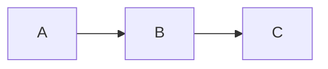

# Mermaid



# Math

$$x = {-b \pm \sqrt{b^2-4ac} \over 2a}$$

# Syntax highlighting

```emacs-lisp
(use-package markdown-xwidget
  :straight (markdown-xwidget
             :type git
             :host github
             :repo "cfclrk/markdown-xwidget"
             :files (:defaults "resources"))
  :config
  (setq markdown-xwidget-github-theme "light"
        markdown-xwidget-mermaid-theme "forest"
        markdown-xwidget-code-block-theme "github"))
```
